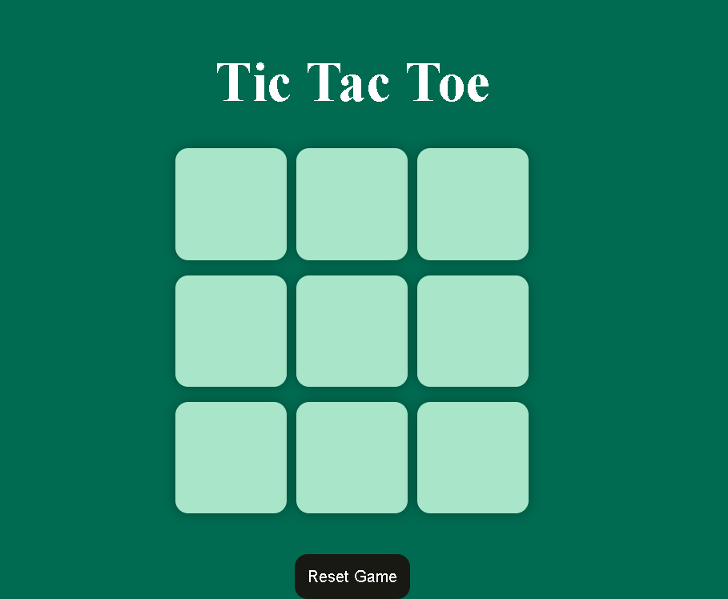

# 🎮 Tic Tac Toe Game

This is a classic Tic Tac Toe game built using **HTML**, **CSS**, and **JavaScript**. It features an interactive user interface, responsive layout, and winner pop-up animation. The game supports two-player mode and handles win/draw conditions with visual feedback.



## ✨ Features

- 👥 Two-player game (O and X)
- 🎨 Stylish green-themed UI
- ✅ Highlighted box colors on each move
- 🏆 Displays winner with a pop-up
- 🔄 Reset and New Game functionality
- 📱 Responsive layout for all screen sizes

## 🚀 Live Demo

Play the game here: [https://shushmitaaaa.github.io/Tic-Tac-Toe/](https://shushmitaaaa.github.io/Tic-Tac-Toe/)

## 🛠️ Technologies Used

- 🧾 HTML
- 🎨 CSS
- ⚙️ JavaScript

## 🧑‍💻 Setup Instructions

1. Clone the repository:
   ```bash
   git clone https://github.com/Shushmitaaaa/Tic-Tac-Toe.git
   ```
2. Open the folder in a code editor.
3. Open `index.html` in a browser to run the game locally.

## 📄 License

This project is open-source and free to use.
